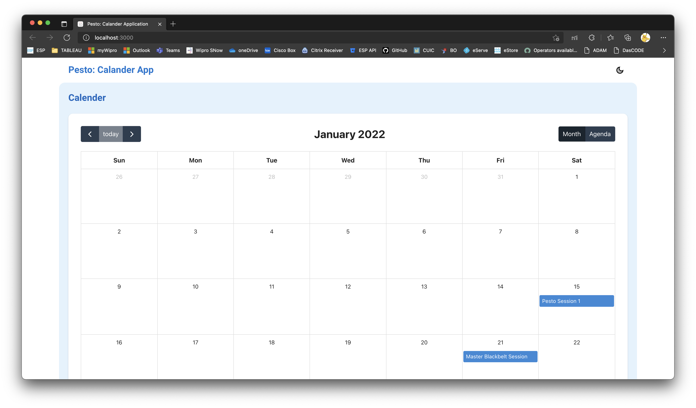
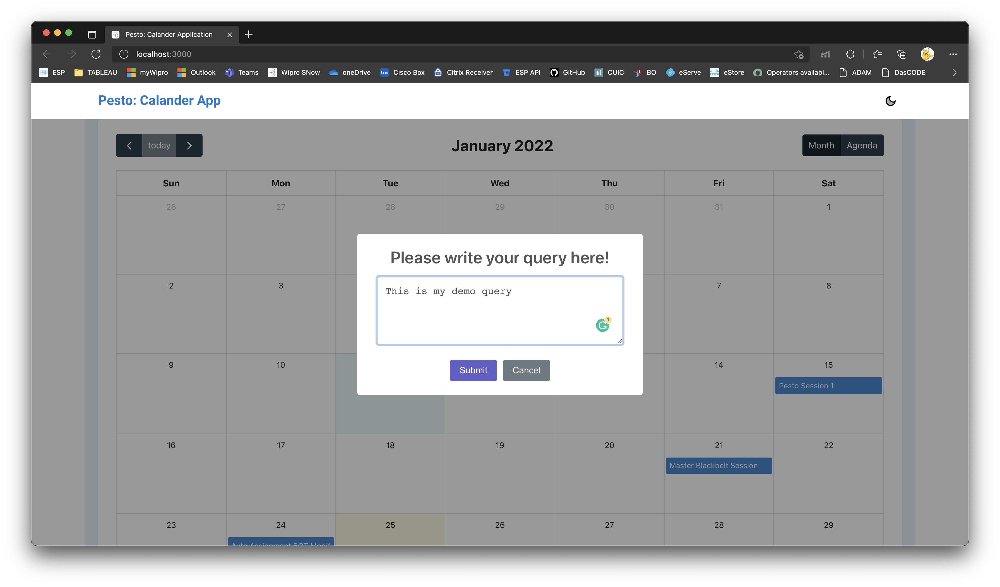
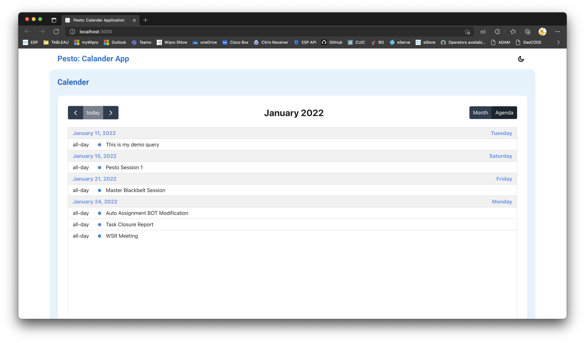
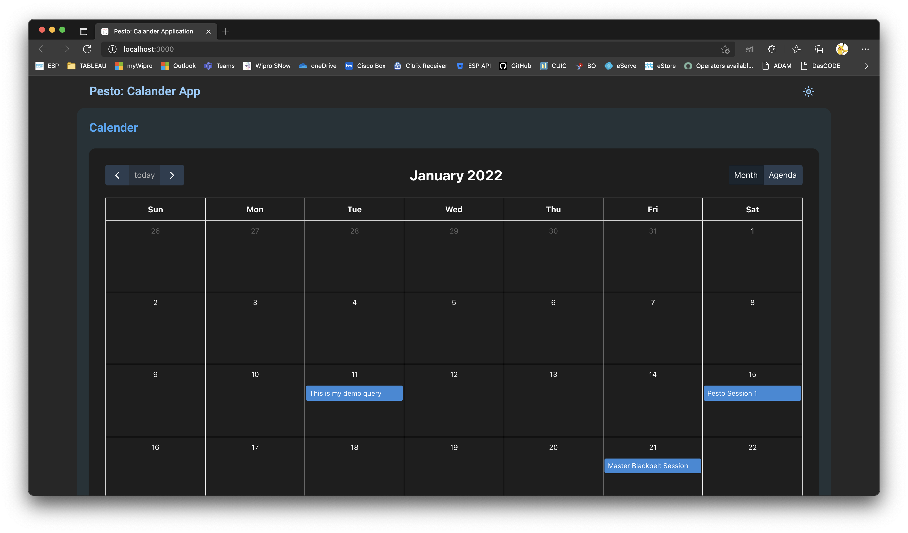

# Pesto: Calendar App

This is an demo application build for Pesto as a part of the assignment. This Web App is React & NodeJS based and captures user query through a Calendar and stores under a JSON file.

## Index

* [About](#about)
* [Prerequisits](#prerequisits)
* [Tech Stacks](#tech-stacks)
* [Installation](#installation)
..* [Backend Installation](#backend-installation)
..* [Frontend Installation](#frontend-installation)
* [Running the Code](#running-the-code)
* [User Guide](#user-guide)
..* [Adding query to the Calendar](#adding-query-to-the-calendar)
..* [Changing the Month](#changing-the-month)
..* [Showing all the queries per month](#showing-all-the-queries-per-month)
..* [Changing the view mode](#changing-the-view-mode)
* [Developer Contact](#developer-contact)

## About

The Calendar Application is a part of the Pesto Coding Assignment. It is a calendar app in which a user can click on any date and enter their query in that. This application will store that information in a JSON file using NodeJS.

## Prerequisits

To initialize with this project the following software packages should be installed in the host machine
* Python v3.9.6
* Node JS v14.17.0
* npm v7.16.0

## Tech Stacks

For developing this application, we have used - 
* ReactJS (The Frontend  of the Application)
* Material UI (For the UI/UX Design)
* FullCalendar (For the Calendar App)
* NodeJS (The backend of the Application)

## Installation

After installing the prerequisites, download the zip of this repository or clone it to your system. There will be two parts of the installation, 

### Backend Installation
After downloading the project, go to the project directory and run the following command through the terminal. It will install all the dependencies for the NodeJS project.

```npm install```

### Frontend installation
To install the ReactJS Application, go to the **client** sub-directory under the project directory and run the following command through the terminal.

```npm install```

## Running the Code

After completing the prerequisites and the installation procedure,  we can start the application. To start the application, we must follow the below steps,

1. Run ```npm start``` command from the project directory. It will run the server-side of the application. If you are facing any issue related to the PORT, go to the **index.js** file under the **server** directory and change the variable PORT accordingly. 

2. If you are changing the PORT value in step 1 or after executing ```npm start``` if the application chooses another port as PORT 3001 (Default Port) is unavailable, then you must go to **client/package.json** and change the port number from the **proxy** (```"proxy": "http://localhost:3001"```) option accordingly. **This option is very crucial for the frontend to talk with the backend successfully**.

3. Once the backend server starts running, go to the **client** directory and execute the ```npm start``` command. It starts front end of the application. A window will pop up in your default browser for you to access the application. The default port for the frontend is 3000, to change that, you can go to **client/package.json** and edit the **start** option under **scripts** at line 29, and insert the desired port details there. E.g. ```"start": "PORT=1500 react-scripts start"```, here the application will initiate at port 1500.

## User Guide

Once the site is up and running, your default browser will start presenting the application. At this stage, the application is ready to use. 



### Adding query to the Calendar

The default view for this calendar app is the Month view. Once a user opens the app and clicks on any date for that month, a pop-up window with a text area will open to fill up the query. The input validation is in place for that text area. If the user fills that text area and submits that, it will insert that details to the backend JSON file and show that in the calendar. Even if we refresh the page or create a new session, those data will be preserved, given that the JSON file is intact. 



### Changing the Month

Changing a month in the calendar is easy. On the top left side of the calendar, three buttons will allow the user to go to the previous month, come back to the current month, and go to the next month, respectively, considering those buttons left to the right. As you change those details, the title will change in the middle of the page, showing which month and year you are currently previewing.

### Showing all the queries per month

On the top left side of the calendar, two buttons will help you toggle the monthly grid view and monthly agenda view. In the agenda view, users can take the help of the navigation buttons on the left to list out all the queries created in one place.



### Changing the view mode

You can toggle dark mode and light mode using the button on the top right corner of the web app. 



## Developer Contact

#### Debjit Sadhukhan
#### +91 83358 39446
#### debjit95@engineer.com
#### Bangalore, India